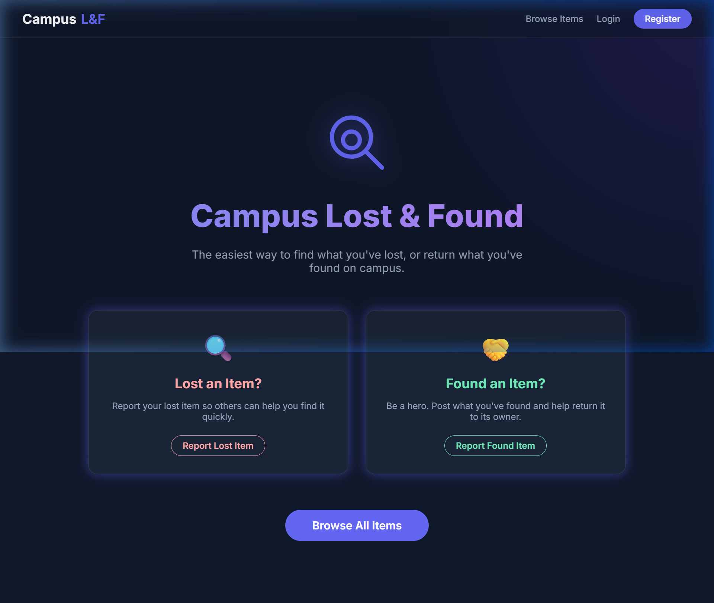
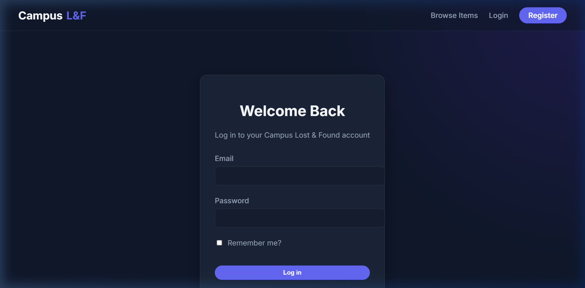
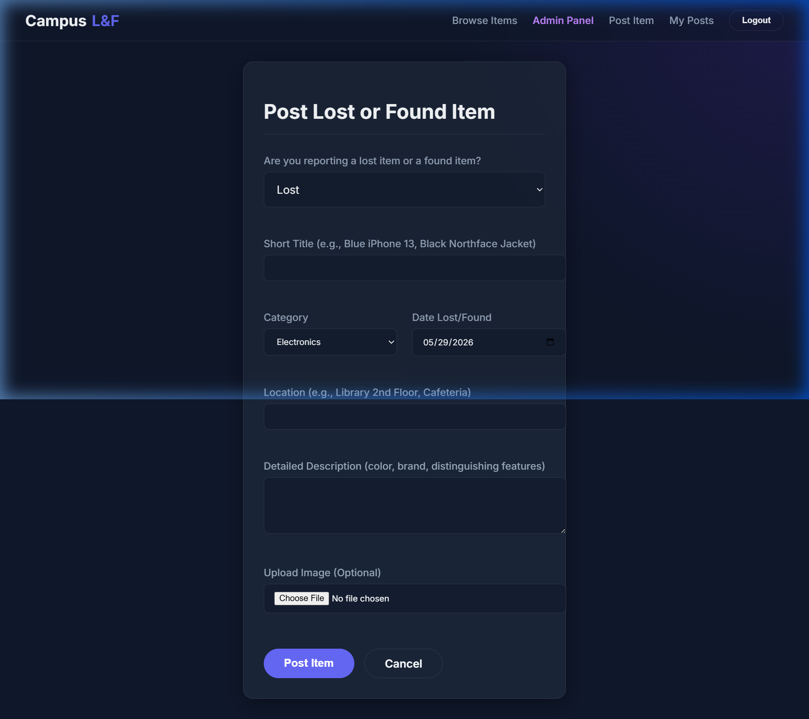
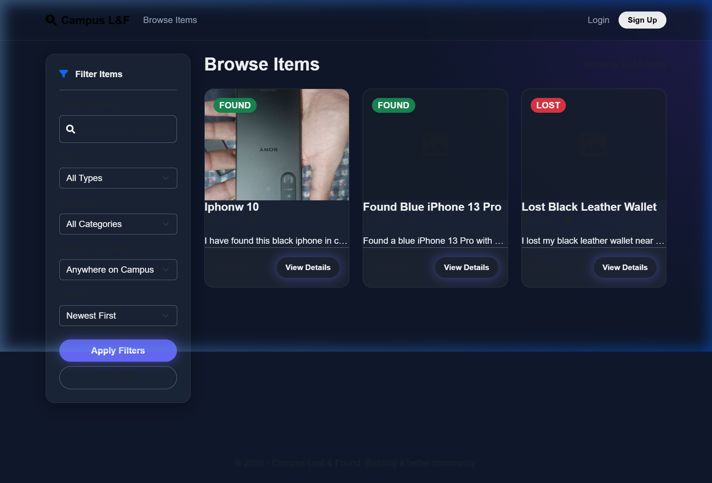

# Campus Lost & Found System
### Final Project Report

**Course Name:** Web Development  
**Instructor:** [Insert Instructor Name]  
**Date:** May 29, 2026  

**Project Members:**
1. Mohyuddin Rao (Lead Developer)
2. [Insert Member Name & ID]
3. [Insert Member Name & ID]

---

## 1. Introduction

### 1.1 Purpose
The **Campus Lost & Found System** is a comprehensive web application designed to help students, faculty, and staff securely and efficiently report lost items and reunite found items with their rightful owners across the campus.

### 1.2 Scope
The system features a complete end-to-end user experience, including user authentication, item posting, categorical filtering, a secure claiming system, and real-time notifications. The administrative backend provides moderation controls for users, announcements, and items. 

### 1.3 Technologies Used
*   **Backend Framework:** ASP.NET Core 8.0 MVC
*   **Database:** Microsoft SQL Server with Entity Framework Core (Code-First)
*   **Authentication:** ASP.NET Core Identity
*   **Frontend UI:** HTML5, Bootstrap 5, Custom CSS Variables
*   **Design Language:** Premium Dark-Mode Glassmorphism (Backdrop Blurs, Dynamic Hover Effects)
*   **Asynchronous Processing:** AJAX / jQuery for notifications and dynamic UI updates

---

## 2. System Architecture

The application strictly adheres to the **Model-View-Controller (MVC)** architectural pattern:

*   **Models:** Defines the core data structures (`Item`, `ApplicationUser`, `Claim`, `Notification`, `Building`, `Category`). Relationships are managed via EF Core Fluent API and Data Annotations.
*   **Controllers:** Handles business logic and HTTP requests (`ItemsController`, `AdminController`, `NotificationsController`, `ProfileController`).
*   **Views:** Razor Pages (`.cshtml`) strongly typed to ViewModels, utilizing a shared `_Layout.cshtml` for a consistent Glassmorphism UI.

---

## 3. Major Features

1.  **Secure Authentication:** User registration, login, and profile management utilizing ASP.NET Identity.
2.  **Item Management System:** Users can post items as "Lost" or "Found" with multiple image uploads, specific building locations, categories, and optional reward amounts.
3.  **Claim Resolution Engine:** Users can submit claims on "Found" items with proof descriptions. Item posters can review, approve, or reject these claims, automatically resolving the item state upon approval.
4.  **Live Notification Center:** A dropdown tracking real-time status updates (e.g., "Your claim was approved", "New announcement").
5.  **Administrative Dashboard:** Full CRUD capabilities for system categories, buildings, system-wide announcements, and user ban/activation moderation.

---

## 4. System Screenshots

### 4.1 Home Page (Glassmorphism Dashboard)


### 4.2 User Authentication (Login)


### 4.3 Post an Item (Create View)


### 4.4 Item Browse Grid (Browse Items)



---

## 5. Core Source Code (Snippets)

Below are selected snippets demonstrating the core architecture and coding standards of the application.

### 5.1 Domain Model: `Item.cs`
```csharp
using System.ComponentModel.DataAnnotations;

namespace WEBDEV_Project.Models
{
    public class Item
    {
        public int Id { get; set; }
        
        [Required, StringLength(100)]
        public string Title { get; set; } = string.Empty;
        
        [Required]
        public string Description { get; set; } = string.Empty;
        
        public ItemType Type { get; set; } // Lost or Found
        public ItemStatus Status { get; set; } // Active, Resolved, Expired
        
        // Foreign Keys
        public string UserId { get; set; } = string.Empty;
        public ApplicationUser? User { get; set; }
        
        public int CategoryId { get; set; }
        public Category? Category { get; set; }
        
        public int BuildingId { get; set; }
        public Building? Building { get; set; }

        public DateTime PostedAt { get; set; } = DateTime.UtcNow;
        public ICollection<ItemImage> Images { get; set; } = new List<ItemImage>();
        public ICollection<Claim> Claims { get; set; } = new List<Claim>();
    }

    public enum ItemType { Lost, Found }
    public enum ItemStatus { Active, Resolved, Expired }
}
```

### 5.2 Controller Logic: `ItemsController.cs` (Create Item)
```csharp
[HttpPost]
[ValidateAntiForgeryToken]
[Authorize]
public async Task<IActionResult> Create(CreateItemViewModel model)
{
    if (ModelState.IsValid)
    {
        var item = new Item
        {
            Title = model.Title,
            Description = model.Description,
            Type = model.Type,
            CategoryId = model.CategoryId,
            BuildingId = model.BuildingId,
            UserId = UserManager.GetUserId(User)!,
            Status = ItemStatus.Active
        };

        DbContext.Items.Add(item);
        await DbContext.SaveChangesAsync();
        
        // Notification Logic
        TempData["SuccessMessage"] = "Item posted successfully!";
        return RedirectToAction(nameof(Index));
    }
    
    // Repopulate ViewBags on failure
    ViewBag.Categories = new SelectList(await DbContext.Categories.ToListAsync(), "Id", "Name", model.CategoryId);
    ViewBag.Buildings = new SelectList(await DbContext.Buildings.ToListAsync(), "Id", "Name", model.BuildingId);
    return View(model);
}
```

### 5.3 UI Architecture: Glassmorphism CSS (`site.css`)
```css
/* Glassmorphism Panel Foundation */
.glass-panel {
    background: var(--glass-bg);
    backdrop-filter: var(--glass-blur);
    -webkit-backdrop-filter: var(--glass-blur);
    border: 1px solid var(--border-light);
    border-radius: 1.5rem;
    box-shadow: var(--shadow-glass);
    transition: all var(--transition-normal);
}

.glass-panel:hover {
    box-shadow: var(--shadow-glow);
    border-color: rgba(255, 255, 255, 0.15);
}
```
